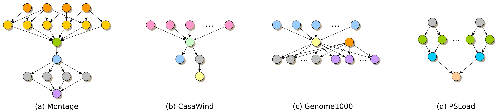

# dApollo: Dynamic Workflow Scheduling

**[dApollo](src/main/java/at/uibk/dps/sc/core/scheduler/SchedulerDApollo.java)** is a dynamic workflow scheduling algorithm for distributed runtime systems across the Edge-Cloud continuum. 
dApollo is integrated in the distributed runtime system [Apollo](https://github.com/Apollo-Core).

### Requirements

- Workflow in [AFCL](https://apollowf.github.io/learn.html) format
- Available resources for each task (typemappings)
- Scheduler configuration input, including resource bandwidth, acquisition delay of each resource and cost limit for the overall schedule

### Features

- Open-source
- Targets the Edge-Cloud continuum
- Optimizes for runtime while adhering to a given cost limit
- Dynamically maps tasks to resources and orchestrates groups of workflow tasks to effectively use distributed runtime system instances
- Reacts to dynamically updated task runtimes to take resource performance fluctuations into account
 
### Getting started

Please refer to the documentation of the [Apollo Demo](https://github.com/Apollo-Core/EE-Demo) to get started with Apollo. The dApollo scheduling Algorithm currently supports simulated executions. The algorithm was evaluated using four well known scientific workflows: [Montage](http://montage.ipac.caltech.edu/), [CasaWind](https://zenodo.org/records/5889207), [Genome1000](https://github.com/pegasus-isi/1000genome-workflow) and [PSLoad](https://legacy.cs.indiana.edu/ftp/techreports/TR671.pdf).

